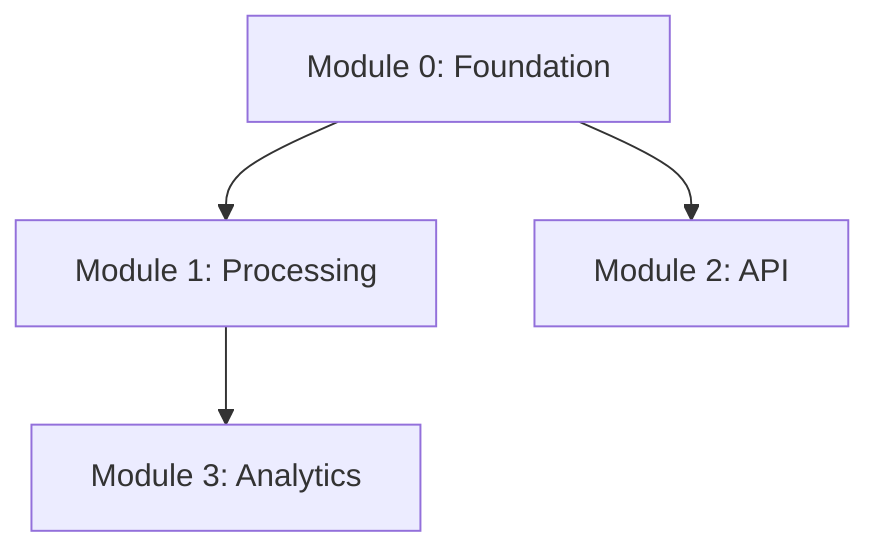

# Feature: Phase 9 — Context Plugin & Monorepo Structure

The following plan should be complete, but validate documentation and codebase patterns before implementing.
Pay special attention to naming conventions and frontmatter format of existing commands.

## Feature Description

Create 5 new slash commands (`/scaffold`, `/discuss-module`, `/discuss-slice`, `/review-context`,
`/map-dependencies`) that scaffold projects into a standardized context monorepo structure and guide
developers through populating it via multi-turn AI conversations. This is the foundation of Gen 3 —
all subsequent phases depend on the monorepo structure and artifact templates defined here.

## User Story

As a solo developer starting a complex multi-module project
I want structured context capture tools that produce consistent, agent-readable specifications
So that an autonomous agent coalition can build from my validated context without ambiguity

## Problem Statement

Current PIV loop uses flat PRD phases — sufficient for single-concern projects but inadequate for
multi-module systems with cross-module dependencies, parallel build streams, and domain-specific
validation gates. Developers need structured guidance to produce complete specifications.

## Solution Statement

Five slash commands that: (1) create predictable directory layouts, (2) conduct structured
conversations to elicit complete specifications, (3) validate completeness before agent handover,
and (4) generate machine-readable dependency graphs for parallel execution planning.

## Feature Metadata

**Feature Type**: New Capability
**Estimated Complexity**: Medium
**Primary Systems Affected**: `.claude/commands/` (5 new markdown files)
**Dependencies**: None — markdown commands using native Claude Code capabilities
**Agent Behavior**: Yes — commands implement conversational decision trees from PRD Section 4.2/4.4

---

## CONTEXT REFERENCES

### Relevant Codebase Files — MUST READ BEFORE IMPLEMENTING

- `.claude/commands/create-prd.md` — MIRROR: frontmatter format, length constraint enforcement,
  embedded template pattern, hooks block format, reasoning/reflection sections
- `.claude/commands/prime.md` — MIRROR: manifest read/reconcile pattern, evolution mode detection,
  terminal-only output format with reasoning + reflection + hooks
- `.claude/commands/plan-feature.md` — MIRROR: multi-phase process structure, Phase 0 scope
  analysis pattern, PRD cross-referencing
- `.claude/commands/research-stack.md` — MIRROR: per-technology parallel execution pattern,
  profile file creation, manifest `profiles` section updates
- `.claude/commands/evolve.md` — MIRROR: manifest merge pattern (read → modify → write back),
  terminal output format, validation before proceeding
- `.claude/commands/commit.md` — MIRROR: lightweight command structure, frontmatter pattern
- `PRD-gen2.md` (lines 489-537) — Phase 1 scope definition, acceptance criteria, done-when list
- `PRD-gen2.md` (lines 96-159) — Decision trees for Context Plugin conversation flow, review
  context handover gate, pipeline validator
- `PRD-gen2.md` (lines 160-259) — Scenario definitions SC-001 through SC-004, SC-003b
- `PRD-gen2.md` (lines 275-410) — User stories US-001, US-002, US-003 with acceptance criteria
- `PRD-gen2.md` (lines 411-441) — Architecture patterns: artifact templates, monorepo structure,
  event-driven spawning, manifest as truth
- `CLAUDE.md` (Section 4) — Command file structure conventions
- `CLAUDE.md` (Section 5) — Command writing conventions (frontmatter, headers, directives)

### New Files to Create

- `.claude/commands/scaffold.md` — Project scaffolding command (~250 lines)
- `.claude/commands/discuss-module.md` — Module specification conversation (~300 lines)
- `.claude/commands/discuss-slice.md` — Slice context conversation (~300 lines)
- `.claude/commands/review-context.md` — Completeness audit command (~200 lines)
- `.claude/commands/map-dependencies.md` — Dependency graph generator (~200 lines)

### Patterns to Follow

**Frontmatter**: YAML `---` block with `description` and optional `argument-hint`. MIRROR: `create-prd.md:1-4`
**Section Flow**: `# Title` → `## Overview` → `## Process` → `## Output` → `### Reasoning` → `### Reflection` → `## PIV-Automator-Hooks`
**Hooks Block**: Regex-parseable `key: value` pairs, 5-15 lines, snake_case keys, appended to file/terminal output
**Manifest**: Read → modify specific section → write back. Never overwrite. MIRROR: `evolve.md`

---

## AGENT BEHAVIOR IMPLEMENTATION

### Decision Trees to Implement

**DT-1: Discussion Conversation Flow** (PRD Section 4.2, applies to /discuss-module and /discuss-slice):
- FIRST: Read parent context (architecture.md for modules, specification.md for slices)
- THEN: Assess what's documented — identify gaps vs confirmed decisions
- FOR EACH template section missing coverage → ask targeted questions
- IF requirements vague → push for specifics: measurable gates, concrete schemas
- IF edge cases not addressed → suggest scenarios with reasoning
- IF technology trade-offs exist → recommend with reasoning tied to existing context
- WHEN all template sections covered → generate artifact from template
- THEN: Present to human → revise until approved
- ON INCOMPLETE → save partial, mark gaps, add to review-context checklist

**DT-2: Review-Context Handover Gate** (PRD Section 4.2):
- FOR EACH module → check: specification.md exists AND all sections populated
- FOR EACH slice → check: context.md exists AND validation gates measurable AND infra listed
- FOR EACH technology referenced → check: profile exists in context/profiles/
- FOR EACH slice with external deps → check: test data documented
- IF all pass → "Ready for agent handover"
- IF gaps → actionable checklist with specific `/discuss-*` or `/research-stack` commands

### Scenario Mappings

| Scenario | Agent Workflow | Decision Tree | Success Criteria |
|---|---|---|---|
| SC-001 | /scaffold creates dirs, vision.md, git init | N/A (procedural) | Full tree + stubs created |
| SC-002 | /discuss-module reads arch, probes, generates spec | DT-1 | Valid specification.md |
| SC-003 | /discuss-slice reads parent spec, probes, generates ctx | DT-1 | Valid context.md with measurable gates |
| SC-003b | /map-dependencies reads all specs, extracts deps | N/A (analytical) | Mermaid + YAML DAG |
| SC-004 | /review-context scans all artifacts, reports gaps | DT-2 | Correct gap identification |

### Error Recovery

- Module folder doesn't exist → create it and proceed (SC-002 error case)
- Parent specification missing → prompt to run `/discuss-module` first (SC-003 error case)
- Target directory exists → prompt to merge or abort (SC-001 error case)
- Circular dependency detected → report cycle, suggest restructuring (SC-003b error case)
- No context monorepo found → suggest `/scaffold` first (SC-004 error case)

---

## FOUNDATION

**Generation:** 3 | **Active PRD:** PRD-gen2.md
**Gens 1-2:** Phases 1-4 (orchestrator: session mgmt, Telegram, resilience, multi-instance) + Phases 5-8 (supervisor: bootstrap, monitor, diagnosis/hot-fix, SuperMemory). All validated.
**Existing commands:** 12 in `.claude/commands/` — new commands go alongside, not replacing.
**Key constraint:** Phase 9 creates markdown commands only. Manifest schema evolution is Phase 10.

---

---

## STEP-BY-STEP TASKS

### Task 1: CREATE `.claude/commands/scaffold.md`

**IMPLEMENT**: The `/scaffold` command that creates the full monorepo directory structure.

**Frontmatter:**
```yaml
---
description: Scaffold a new project into context monorepo structure
argument-hint: [project-name]
---
```

**Required Sections:**

1. **Overview** — What the command does: creates standardized project structure for agent consumption
2. **Reasoning Approach** — Zero-shot CoT
3. **Arguments** — `$ARGUMENTS` is the project name (required). Parse module count from conversation.
4. **Process** — Step-by-step:
   - Step 1: Parse project name from `$ARGUMENTS`
   - Step 2: Check if target directory exists → if yes, prompt merge or abort (SC-001 error)
   - Step 3: Create directory structure (see below)
   - Step 4: Generate `vision.md` from conversation with developer (ask: purpose, target users,
     success metrics, constraints)
   - Step 5: Create `architecture.md` stub (header + placeholder for `/map-dependencies`)
   - Step 6: Create `domain-knowledge.md` stub (header + instructions for human to populate)
   - Step 7: FOR EACH module discussed → create `context/modules/{module-name}/` with empty
     `specification.md` stub
   - Step 8: Initialize git repository (`git init`, create `.gitignore`)
   - Step 9: Generate `CLAUDE.md` with project-specific rules referencing monorepo conventions
   - Step 10: Terminal output with reasoning, reflection, hooks

5. **Directory Structure** (embed this as the canonical reference):
```
{project-name}/
├── context/
│   ├── modules/
│   │   ├── {module-name}/
│   │   │   ├── specification.md        # /discuss-module output
│   │   │   └── slices/
│   │   │       └── {slice-id}/
│   │   │           └── context.md      # /discuss-slice output
│   │   └── ...
│   ├── profiles/                       # /research-stack output (symlink or copy)
│   ├── research/                       # raw research notes
│   ├── vision.md                       # /scaffold output
│   ├── architecture.md                 # /map-dependencies output
│   └── domain-knowledge.md            # human-maintained
├── src/                                # source code (agent-generated)
├── test-data/                          # test fixtures and sample data
├── .agents/
│   ├── manifest.yaml
│   ├── plans/
│   ├── validation/
│   ├── progress/
│   └── reference/                      # technology profiles
├── .claude/
│   └── commands/                       # PIV commands (copied from dev kit)
├── CLAUDE.md
└── .gitignore
```

6. **vision.md Template** (embed in command):
```markdown
# Project Vision: {project-name}

## Purpose
[What this project does and why it exists]

## Target Users
[Who uses this and how]

## Success Metrics
[Measurable outcomes that define success]

## Constraints
[Technical, business, or resource constraints]

## Modules Overview
| Module | Purpose | Key Dependencies |
|--------|---------|-----------------|
| {name} | {brief} | {deps or "none"} |

## Last Updated
[date]
```

7. **Edge Cases:**
   - Module count is 0 → create structure without `modules/` subdirectories (SC-001 edge)
   - Project name has spaces → kebab-case conversion
   - `.agents/` already exists → preserve existing, merge structure

8. **Hooks Block:**
```
## PIV-Automator-Hooks
scaffold_status: complete
project_name: {name}
modules_created: {N}
structure_valid: true
git_initialized: true
next_suggested_command: discuss-module
next_arg: "{first-module-name}"
confidence: high
```

**PATTERN**: MIRROR frontmatter from `create-prd.md:1-4`, hooks from `evolve.md`
**VALIDATE**: Frontmatter parses as valid YAML. Directory structure matches spec.

---

### Task 2: CREATE `.claude/commands/discuss-module.md`

**IMPLEMENT**: Multi-turn conversation command that produces `specification.md` for a module.

**Frontmatter:**
```yaml
---
description: Guided conversation to produce a module specification
argument-hint: [module-name]
---
```

**Required Sections:**

1. **Overview** — Conversational command that reads existing project context (vision.md,
   architecture.md), then guides the developer through defining a module's specification via
   structured dialogue. Not a form — a probing conversation.

2. **Reasoning Approach** — Few-shot CoT. Include example question-answer patterns:
   - Good: "Module 0 serves map queries — does it need PostGIS for spatial indexing, or is
     GeoJSON in MongoDB sufficient given your read-heavy pattern?"
   - Bad: "What database do you want?"

3. **Process:**
   - Step 1: Parse module name from `$ARGUMENTS`
   - Step 2: Locate module folder at `context/modules/{module-name}/`
     - If folder doesn't exist → create it (SC-002 error case)
   - Step 3: Read `context/vision.md` and `context/architecture.md` for project context
   - Step 4: Check if `specification.md` already exists → if partial, resume from gaps
   - Step 5: **Conversation Phase** — Walk through each specification template section:
     - Module purpose and responsibility boundary
     - Slice breakdown (what are the implementation units?)
     - Data contracts with other modules (bidirectional: provides X to Y, consumes Z from W)
     - Technology requirements and recommendations (with reasoning)
     - Infrastructure needs (databases, queues, external services)
     - Testing scenario seeds (at least 3 per module)
   - Step 6: FOR EACH section → ask targeted questions, probe for completeness, recommend
     approaches with reasoning tied to vision.md and architecture.md context
   - Step 7: Track mentioned technologies → list at end for `/research-stack`
   - Step 8: When all sections covered → generate `specification.md` from template
   - Step 9: Present to human for review → revise until approved
   - Step 10: ON INCOMPLETE (human stops early) → save partial, mark incomplete sections

4. **specification.md Template** (embed in command):
```markdown
# Module: {module-name}

## Purpose
[What this module does — its bounded responsibility]

## Slice Breakdown
| Slice ID | Name | Description | Dependencies |
|----------|------|-------------|--------------|
| 01-{id} | {name} | {what it builds} | {other slices or "none"} |

## Data Contracts

### Provides (to other modules)
| Data | Format | Consumer Module | Frequency |
|------|--------|----------------|-----------|

### Consumes (from other modules)
| Data | Format | Provider Module | Frequency |
|------|--------|----------------|-----------|

## Technology Requirements
| Technology | Purpose | Profile Exists? |
|------------|---------|----------------|

## Infrastructure
| Service | Purpose | Provisioning |
|---------|---------|-------------|

## Testing Seeds
| Scenario | Type | What to Test |
|----------|------|-------------|

## Status
- Specification: [complete/partial]
- Slices defined: [N]
- Technologies needing profiles: [list or "none"]
```

5. **Hooks Block:**
```
## PIV-Automator-Hooks
module_name: {name}
spec_status: complete
slices_defined: {N}
technologies_identified: {comma-list}
profiles_needed: {comma-list or "none"}
next_suggested_command: discuss-slice
next_arg: "{first-slice-id}"
confidence: high
```

**PATTERN**: MIRROR conversation style from PRD-gen2.md Section 4.2 DT: Discussion Flow
**GOTCHA**: Must probe for MEASURABLE gates — not "works correctly" but "accuracy ≥ 90%", "response time < 500ms".
**GOTCHA**: Data contracts must be bidirectional — remind developer of this during conversation.
**VALIDATE**: specification.md follows template with all sections populated.

---

### Task 3: CREATE `.claude/commands/discuss-slice.md`

**IMPLEMENT**: Multi-turn conversation command that produces `context.md` for a slice.

**Frontmatter:**
```yaml
---
description: Guided conversation to produce a slice context document
argument-hint: [module-name/slice-id]
---
```

**Required Sections:**

1. **Overview** — Reads parent module's `specification.md` to understand boundaries, then
   conducts structured dialogue about technology choices, schema design, API design,
   infrastructure, and validation gates. Generates the primary artifact agents consume.

2. **Reasoning Approach** — Few-shot CoT. Examples:
   - Good: "Given Module 0 serves read-heavy map queries, I recommend denormalized GeoJSON
     storage because it avoids joins on every map tile request."
   - Bad: "What format should the data be in?"

3. **Arguments** — `$ARGUMENTS` format: `{module-name}/{slice-id}` or just `{slice-id}` if
   module is inferred from current context.

4. **Process:**
   - Step 1: Parse module-name and slice-id from `$ARGUMENTS`
   - Step 2: Locate parent `specification.md` at `context/modules/{module-name}/specification.md`
     - If missing → error: "Run `/discuss-module {module-name}` first" (SC-003 error)
   - Step 3: Read parent specification to understand slice boundaries, module purpose, data contracts
   - Step 4: Read `context/vision.md` and `context/architecture.md` for broader context
   - Step 5: Check if `context.md` already exists → resume from gaps if partial
   - Step 6: **Conversation Phase** — Walk through context template sections:
     - Technology decisions WITH rationale (not just "use Postgres" but WHY)
     - Schema/data model design (fields, types, relationships, indices)
     - API contracts (endpoints, request/response shapes, auth)
     - Infrastructure requirements (what services, how provisioned)
     - Error handling (what happens when X fails?)
     - **Validation gates — MUST be measurable** (the critical differentiator)
     - Test data requirements (what fixtures, what format, where stored)
     - Technology profiles to generate (list for `/research-stack`)
   - Step 7: Probe actively — "What happens when the geocoding API is down?", "This schema
     implies PostGIS — is that decided or open?"
   - Step 8: Generate `context.md` from template when all sections covered
   - Step 9: Present for review → revise until approved
   - Step 10: ON INCOMPLETE → save partial, mark gaps

5. **context.md Template** (embed in command):
```markdown
# Slice Context: {module-name}/{slice-id}

## Overview
[What this slice builds — its bounded scope within the module]

## Technology Decisions
| Technology | Purpose | Rationale |
|------------|---------|-----------|

## Schema Design
[Data model with fields, types, relationships. Include migration notes if applicable.]

## API Design
| Endpoint | Method | Purpose | Auth | Request | Response |
|----------|--------|---------|------|---------|----------|

## Infrastructure Requirements
| Service | Purpose | Provisioning | Teardown |
|---------|---------|-------------|----------|

## Error Handling
| Error Case | Detection | Recovery | Escalation |
|-----------|-----------|----------|------------|

## Validation Gates
| Gate | Metric | Target | Measurement Method |
|------|--------|--------|--------------------|

**CRITICAL: Every gate must be measurable. Not "works well" but "accuracy ≥ 90%".**

## Test Data Requirements
| Data Set | Format | Location | Purpose |
|----------|--------|----------|---------|

## Technology Profiles Needed
[List technologies that need `/research-stack` profiling]

## Status
- Context: [complete/partial]
- Validation gates defined: [N]
- Infrastructure documented: [yes/no]
```

6. **Hooks Block:**
```
## PIV-Automator-Hooks
module_name: {module}
slice_id: {slice}
context_status: complete
validation_gates_count: {N}
measurable_gates: {N}
technologies_identified: {comma-list}
next_suggested_command: discuss-slice
next_arg: "{next-slice-id or review-context}"
confidence: high
```

**GOTCHA**: Validation gates are THE critical section. Push: "What response time? Under load? Which percentile?" Enables Phase 11 Pipeline Validator.
**GOTCHA**: Infrastructure teardown must be documented — agents clean up after themselves.
**VALIDATE**: context.md has ≥1 measurable validation gate. All sections populated.

---

### Task 4: CREATE `.claude/commands/review-context.md`

**IMPLEMENT**: Completeness audit command implementing DT-2 Handover Gate.

**Frontmatter:**
```yaml
---
description: Validate context monorepo completeness for agent handover
---
```

**Required Sections:**

1. **Overview** — Scans the entire context monorepo against a handover checklist. Reports every
   gap with the specific command to fix it. Terminal-only output (no file artifact).

2. **Reasoning Approach** — Zero-shot CoT

3. **Process:**
   - Step 1: Verify monorepo structure exists (`context/` directory)
     - If not → "No context monorepo found. Run `/scaffold` first." (SC-004 error)
   - Step 2: Read `context/vision.md` — verify it exists and is populated
   - Step 3: Scan `context/modules/` — list all module directories
   - Step 4: FOR EACH module:
     - Check `specification.md` exists and is not a stub
     - Check all template sections are populated (not just headers)
     - Check slice breakdown is defined
     - Extract listed technologies
   - Step 5: FOR EACH slice (from module specs):
     - Check `context.md` exists in `context/modules/{module}/slices/{slice}/`
     - Check all template sections populated
     - **Check validation gates are measurable** — flag any that lack numeric thresholds
       or specific criteria (e.g., "works correctly" → FLAG)
     - Check infrastructure requirements documented
     - Check test data requirements listed
   - Step 6: FOR EACH technology referenced across all specs:
     - Check profile exists in `.agents/reference/` or `context/profiles/`
     - If missing → add to gaps list with `/research-stack {tech}` command
   - Step 7: Check `context/architecture.md` exists and has dependency graph
     - If missing → add to gaps with `/map-dependencies` command
   - Step 8: Check `context/domain-knowledge.md` exists (optional but noted)
   - Step 9: Generate terminal report

4. **Terminal Output Format:**
```
## Context Review: {project-name}

### Summary
- Modules: {N} defined, {N} fully specified
- Slices: {N} defined, {N} with complete context
- Technology profiles: {N} referenced, {N} available, {N} missing
- Validation gates: {N} total, {N} measurable, {N} need revision
- Architecture graph: [present/missing]

### Module Status
| Module | Spec | Slices | Contexts | Gates | Status |
|--------|------|--------|----------|-------|--------|
| {name} | ✅/❌ | {N} | {N}/{total} | {N} measurable | ✅ Ready / ⚠️ Gaps |

### Gaps Found
1. ❌ Module `{name}` missing specification → Run `/discuss-module "{name}"`
2. ❌ Slice `{module}/{slice}` missing context → Run `/discuss-slice "{module}/{slice}"`
3. ⚠️ Slice `{module}/{slice}` gate "works correctly" not measurable → Revise validation gate
4. ❌ Technology `{tech}` not profiled → Run `/research-stack {tech}`
5. ❌ Architecture graph missing → Run `/map-dependencies`

### Verdict
**[Ready for agent handover]** or **[{N} gaps remaining — fix before handover]**
```

5. **Hooks Block** (terminal):
```
## PIV-Automator-Hooks
review_status: ready | gaps_remaining
modules_checked: {N}
slices_checked: {N}
gaps_count: {N}
unmeasurable_gates: {N}
profiles_missing: {N}
next_suggested_command: {discuss-module|discuss-slice|research-stack|map-dependencies|go}
next_arg: "{relevant argument}"
confidence: high
```

**PATTERN**: MIRROR terminal report format from `.claude/commands/prime.md` (section headers, tables)
**VALIDATE**: Verify the command correctly identifies all gap types in DT-2.

---

### Task 5: CREATE `.claude/commands/map-dependencies.md`

**IMPLEMENT**: Reads all specifications, extracts dependencies, generates architecture.md DAG.

**Frontmatter:**
```yaml
---
description: Generate dependency graph from module and slice specifications
---
```

**Required Sections:**

1. **Overview** — Reads all `specification.md` and `context.md` files, extracts declared
   dependencies, and generates a dependency graph in `context/architecture.md`.

2. **Reasoning Approach** — Zero-shot CoT

3. **Process:**
   - Step 1: Scan `context/modules/` for all specification.md files
   - Step 2: FOR EACH module spec → extract: module name, slices, data contracts (provides/consumes)
   - Step 3: FOR EACH slice context.md → extract: technology deps, infrastructure deps, cross-slice deps
   - Step 4: Build adjacency list from extracted dependencies
   - Step 5: Detect circular dependencies → if found, report the cycle and suggest restructuring
     (SC-003b error case)
   - Step 6: Identify parallel work streams (independent subgraphs)
   - Step 7: Generate `context/architecture.md` with:
     - Module map (human-readable table)
     - Mermaid dependency diagram (visual)
     - YAML adjacency list (machine-readable for Mission Controller)
     - Parallel work streams identified
     - Execution order recommendation
   - Step 8: If `architecture.md` already exists → merge new dependency data with existing content

4. **architecture.md Template** (embed key sections):
```markdown
# Architecture: {project-name}

## Module Map
| Module | Purpose | Depends On | Depended By |
|--------|---------|-----------|-------------|

## Dependency Graph


## Dependency DAG (Machine-Readable)
```yaml
modules:
  module-0: { depends_on: [], slices: [01-data-model, 02-import, 03-api] }
  module-1: { depends_on: [module-0], slices: [01-processor, 02-pipeline] }
slices:
  module-0/01-data-model: { depends_on: [] }
  module-0/02-import: { depends_on: [module-0/01-data-model] }
parallel_streams:
  - [module-0/01-data-model]
  - [module-0/02-import, module-1/01-processor]
execution_order:
  - batch_1: [module-0/01-data-model]
  - batch_2: [module-0/02-import, module-0/03-api]
```

## Shared Conventions
[Cross-module patterns: naming, error handling, auth, logging]

## Last Updated
[date]
```

5. **Edge Cases:**
   - Single-module project → trivial graph, still generated (SC-003b edge)
   - No specifications found → error: run `/discuss-module` first
   - Circular dependency → report cycle with affected modules/slices

6. **Hooks Block:**
```
## PIV-Automator-Hooks
graph_status: complete
modules_mapped: {N}
slices_mapped: {N}
circular_deps: {N}
parallel_streams: {N}
max_parallelism: {N}
next_suggested_command: review-context
confidence: high
```

**OUTPUT**: Writes to `context/architecture.md`
**GOTCHA**: YAML adjacency list must be valid YAML — Mission Controller (Phase 11) parses it. Mermaid for humans, YAML for machines. Both must sync.
**VALIDATE**: YAML adjacency list parseable. Mermaid diagram renders correctly.

---

### Task 6: Verify Cross-Command Consistency

**UPDATE**: Review all 5 created commands for consistency.

- **IMPLEMENT**: Verify all frontmatter follows the exact same YAML format
- **IMPLEMENT**: Verify all hooks blocks use consistent key naming (snake_case, no nesting)
- **IMPLEMENT**: Verify conversation commands (/discuss-module, /discuss-slice) both implement
  the same DT-1 conversation flow pattern
- **IMPLEMENT**: Verify artifact templates are compatible — specification.md slice breakdown
  table matches the structure /discuss-slice expects to find
- **IMPLEMENT**: Verify `/review-context` checks match the exact template sections in the other
  commands' templates — no orphaned checks, no unchecked sections
- **IMPLEMENT**: Verify `/scaffold` directory structure matches what other commands expect to
  read from (e.g., /discuss-module looks for `context/modules/{name}/`)
- **GOTCHA**: Template section names must be IDENTICAL across commands. If /discuss-module
  generates "## Data Contracts" then /review-context must check for "## Data Contracts",
  not "## Data Dependencies".

**VALIDATE**: Read all 5 commands sequentially. Verify path references are consistent.

---

## VALIDATION COMMANDS

### Level 1: Syntax & Structure

Verify all 5 command files have valid YAML frontmatter, contain `## Overview`, process steps,
embedded template (if file-producing), and hooks block at end.

### Level 2: Per-Command Integration

| # | Command | Verification |
|---|---------|-------------|
| 1 | `/scaffold "test-project"` | `context/`, `src/`, `test-data/`, `.agents/`, vision.md, .gitignore created; git initialized |
| 2 | `/discuss-module "0-foundation"` | specification.md generated with all template sections; technologies tracked |
| 3 | `/discuss-slice "0-foundation/01-data-model"` | context.md generated with measurable validation gates |
| 4 | `/map-dependencies` | architecture.md contains Mermaid + YAML DAG |
| 5 | `/review-context` | Correctly identifies gaps in partially populated monorepo |

### Level 3: Full Pipeline

Run complete flow: scaffold → discuss-module (2 modules) → discuss-slice (2 slices) →
map-dependencies → review-context. Verify handover gate passes.

---

## ACCEPTANCE CRITERIA

- [ ] All 5 commands created in `.claude/commands/` with valid frontmatter
- [ ] `/scaffold` creates complete directory tree matching the canonical structure
- [ ] `/scaffold` generates vision.md from developer conversation
- [ ] `/scaffold` initializes git repository
- [ ] `/discuss-module` produces specification.md following the embedded template
- [ ] `/discuss-module` implements DT-1 conversation flow (probing, recommending with reasoning)
- [ ] `/discuss-module` tracks technologies for `/research-stack`
- [ ] `/discuss-slice` produces context.md with measurable validation gates
- [ ] `/discuss-slice` reads parent specification and references it in conversation
- [ ] `/review-context` identifies all gap types from DT-2 handover gate
- [ ] `/review-context` provides actionable fix commands for each gap
- [ ] `/map-dependencies` generates both Mermaid and YAML DAG formats
- [ ] `/map-dependencies` detects circular dependencies
- [ ] SC-001, SC-002, SC-003, SC-003b, SC-004 pass validation
- [ ] All commands produce correct hooks blocks (regex-parseable, 5-15 lines)

---

## NOTES

**Decision Record from Scope Analysis:**

1. **No import/migration support in `/scaffold`** — SC-001 is greenfield. Migration is Phase 10
   scope (SC-010). Avoids unnecessary complexity in the foundation phase.

2. **Auto-detect technologies in `/discuss-module`** — Serves US-003 acceptance criteria.
   Technologies mentioned during conversation are tracked and listed in specification.md for
   `/research-stack` follow-up.

3. **Templates embedded in commands** — Matches create-prd.md pattern. No external template
   files to manage or keep in sync.

4. **Partial artifact handling** — Both discuss commands save partial progress if conversation
   ends early. `/review-context` detects and reports incomplete artifacts.

5. **No manifest updates in Phase 9** — These are pure markdown commands. Manifest schema
   evolution for module/slice tracking happens in Phase 10. The commands create files that Phase 10's
   evolved manifest will track.

6. **Measurable validation gates are the critical innovation** — Every `/discuss-slice` gate
   must be numeric or binary. The command MUST push back on vague criteria. This is what enables
   autonomous validation in Phase 11.

## PIV-Automator-Hooks
plan_status: ready_for_execution
phase_source: Phase 9 from PRD-gen2.md (Gen 3)
independent_tasks_count: 5
dependent_chains: 1
technologies_consumed: none
next_suggested_command: execute
next_arg: ".agents/plans/phase-9-context-plugin-monorepo-structure.md"
estimated_complexity: medium
confidence: 8/10
